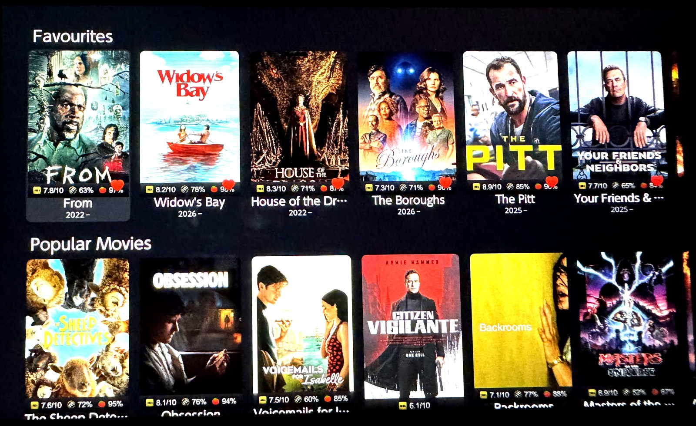
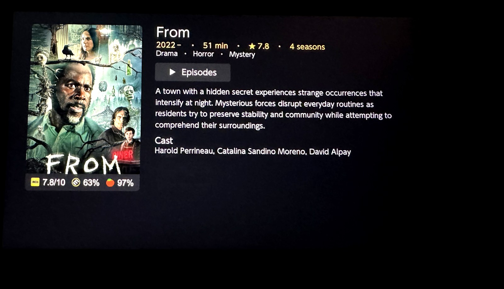
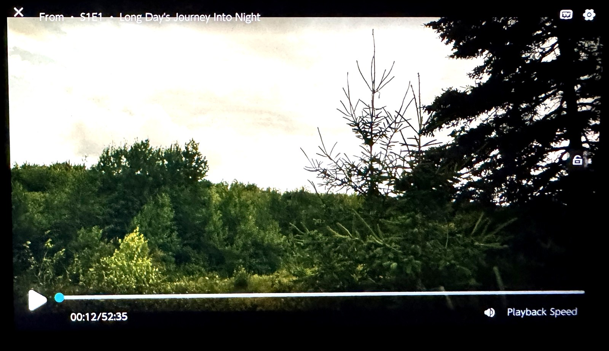
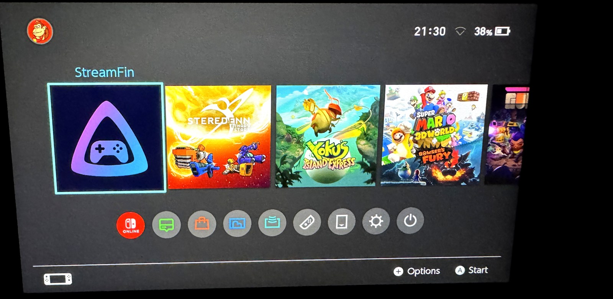

# StreamFin

A **streaming-only Stremio client for homebrewed Nintendo Switch**, built by forking
[Switchfin](https://github.com/dragonflylee/switchfin) and replacing its Jellyfin data layer with
the [Stremio addon protocol](https://github.com/Stremio/stremio-addon-sdk/blob/master/docs/protocol.md).

Browse Cinemeta catalogs, search, open a title page with cast & plot, pick a stream, and play —
all natively on the Switch with MPV. No content is included: **you bring your own Stremio stream
addon URL**, which the app asks for on first launch.

## Screenshots

| Home | Title details |
|---|---|
|  |  |

| Playback | On the home menu |
|---|---|
|  |  |


## Features

- **Home screen** — poster carousels: Popular / New / Top Rated / Animation / Documentary,
  movies & series (Cinemeta)
- **Title details** — poster, year, runtime, IMDb rating, genres, description, cast, director
- **Series support** — seasons → episodes with air dates → stream picker
- **Search** (press Y) via the on-screen keyboard
- **Favourites** (press X on any poster) and **Continue Watching** with resume
- **Custom player controls** tuned for streaming (seek on shoulders, lock screen, stream info)
- Streams play as direct HTTPS URLs through MPV — nothing torrent-related runs on the Switch

## Setup

1. Copy `StreamFin.nro` to `/switch/` on your SD card and launch it (full application mode
   recommended — use a forwarder or title takeover).
2. On first launch you'll be asked for your **stream addon URL** — the base URL of any Stremio
   addon that implements the `stream` resource (paste it with or without `/manifest.json`).
3. Change it any time by pressing **−** on the home screen. It's stored at
   `sdmc:/config/StreamFin/stremio_addon.json`.

Catalog browsing works without an addon; you only need one to actually play streams.

## Controls

| Context | Button | Action |
|---|---|---|
| Home | Y | Search |
| Home | X | Add/remove favourite |
| Home | − | Set stream addon URL |
| Detail page | A on ▶ | Watch (movies) / Episodes (series) |
| Player | L / R | Seek back / forward |
| Player | X | Lock screen |
| Player | − | Stream info |
| Player | + | Settings |

## Building

Requires [devkitPro](https://devkitpro.org/) with devkitA64/libnx and Switchfin's custom
[switch-portlibs](https://github.com/dragonflylee/switchfin/releases/tag/switch-portlibs)
(mbedtls, libssh2, dav1d, curl, ffmpeg, libmpv, libjpeg-turbo).

```bash
export PKG_CONFIG_LIBDIR=/opt/devkitpro/portlibs/switch/lib/pkgconfig
export PKG_CONFIG_PATH=/opt/devkitpro/portlibs/switch/lib/pkgconfig
cmake -B build_switch -G Ninja -DPLATFORM_SWITCH=ON -DBUILTIN_NSP=OFF
ninja -C build_switch StreamFin.nro
```

## Credits

- [Switchfin](https://github.com/dragonflylee/switchfin) by dragonflylee — the base app this
  project forks (player, UI framework integration, build system)
- [borealis](https://github.com/natinusala/borealis) — Switch-style UI library
- [Stremio](https://www.stremio.com/) — the addon protocol and the public Cinemeta catalog

## Disclaimer

This app is a generic client for the open Stremio addon protocol. It ships with no media and no
addon. What you stream is determined entirely by the addon URL you configure — you are responsible
for using addons and content you have the right to access.

## License

[Apache-2.0](LICENSE), same as Switchfin.
