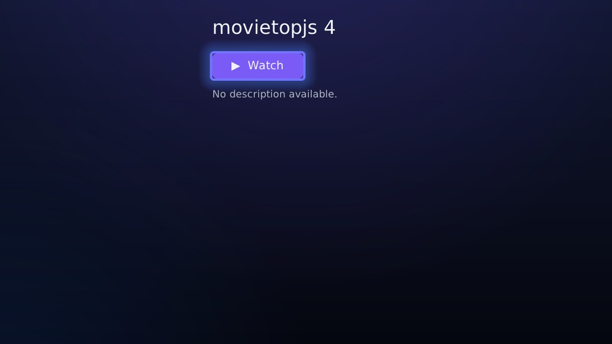
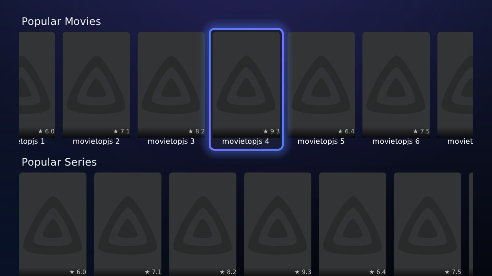
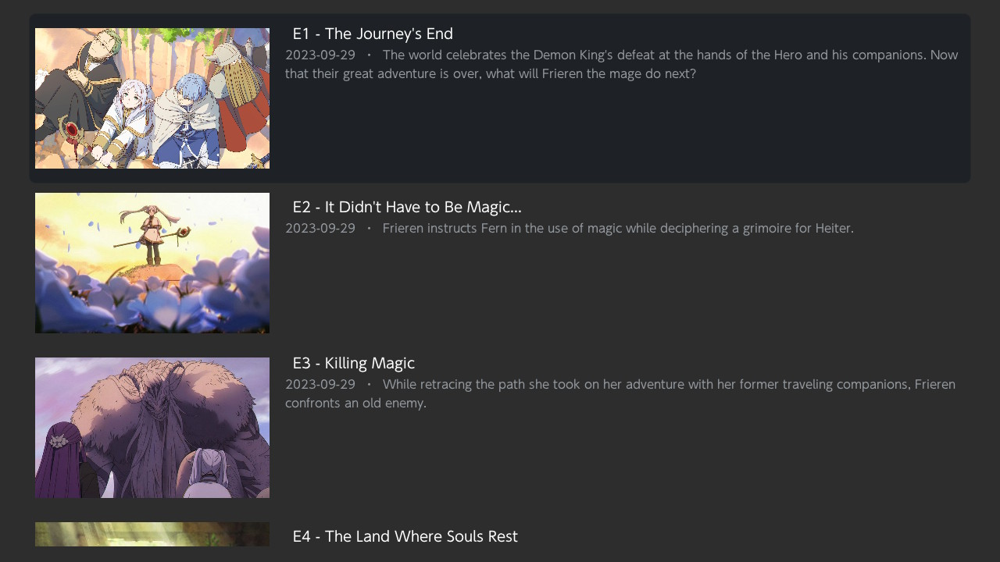

<p align="center">
  
</p>

<h1 align="center">StreamFinEX</h1>

A **streaming-only Stremio client for homebrewed Nintendo Switch**. This is a fork of
[StreamFin](https://github.com/scamNscoot/StreamFin) (itself built on
[Switchfin](https://github.com/dragonflylee/switchfin), with the Jellyfin data layer replaced by
the [Stremio addon protocol](https://github.com/Stremio/stremio-addon-sdk/blob/master/docs/protocol.md)),
reworked to look and feel like **actual Stremio**: a dark ocean-blue/purple theme, glowing
focus, a fully customizable home screen, a Library, anime support, and smooth controller
navigation.

Browse Cinemeta catalogs, search, open a title page with cast & plot, pick a stream, and play —
all natively on the Switch with MPV. No content is included: **you bring your own Stremio stream
addon URL**, which the app asks for on first launch.

This doesn't work with torrents, only HTTPS — most debrid services can provide HTTPS streams.

## Download

Grab the latest `StreamFin.nro` from the
[**Releases page**](https://github.com/Kirbosh/StreamFinEX/releases) and copy it to `/switch/`
on your SD card. Every push to this repo builds a fresh release automatically.

## Screenshots

<p align="center">
  
</p>

| Home — genre carousels | Your Library |
|---|---|
|  |  |

| Episodes | Customize your rows |
|---|---|
|  |  |

## Features

### Look & feel
- **Stremio-style theme** — dark ocean-navy gradient background with purple accents and the
  official Stremio play-diamond icon
- **Glowing focus** — the selected poster has a soft outline that gently breathes between ocean
  blue and Stremio purple, with the pill-shaped Watch/Episodes button matching the same glow
- **Edge-to-edge carousels** — rows run the full width of the screen and show a sliver of the
  next/previous poster at each edge, so it's always clear there's more to scroll

### Browse
- **Customizable home rows** — press the **Stremio logo** (top-left) to open the row editor:
  every catalog is listed (Popular / New / Top Rated plus **all 21 Cinemeta genres** for both
  movies *and* series, plus Anime — 49 rows in total). **A** turns a row on/off, **Y**/**X**
  move it up/down, **B** saves. Your layout persists across launches, and fewer rows means a
  lighter, faster home screen
- **Anime** — a dedicated row (both anime movies and series) powered by the
  [Anime Kitsu](https://anime-kitsu.strem.fun) addon, with a **More** card that opens a full
  anime browse grid and its own anime-only search (keeps anime out of the main search)
- **IMDb rating badges** on every poster, straight from the catalog data
- **Search** — press **Y** anywhere on home or use the search button in the top bar; movie and
  series results are interleaved so nothing gets buried

### Library
- Save any title with **X** — a small dot badge marks saved posters
- The home **Library** row shows your most recent saves plus a **See all** card that opens a
  full grid with **search** and **sort** (recent / name / year / rating)

### Watch
- **Continue Watching** — a home row that resumes any in-progress title exactly where you
  left off; exiting the player returns you to the stream picker so you can hop straight to
  the next episode
- **Title details** — poster, year, runtime, ★ rating, genres, description (with a **See more**
  that opens a fully scrollable synopsis), cast and director
- **Series & anime** — seasons → episodes with thumbnails, titles, air dates and per-episode
  descriptions → stream picker
- **Robust streams** — anime (Kitsu) ids are looked up across the `series` / `anime` / `movie`
  types until your addon answers, so titles that used to fail with an HTTP error now play
- **Custom player controls** tuned for streaming (seek on the shoulder buttons, lock screen,
  stream info). Streams play as direct HTTPS URLs through MPV — nothing torrent-related runs
  on the Switch itself

## Setup

1. Copy `StreamFin.nro` to `/switch/` on your SD card.
2. **Recommended:** while the SD card is still in your PC, create a plain-text file at
   `/switch/streamfin-addon.txt` containing your **stream addon URL** — the base URL of any
   Stremio addon that implements the `stream` resource (with or without `/manifest.json`).
   StreamFinEX imports it automatically at launch — no typing on the console. Editing the file
   later updates the settings too. Full format (all lines optional, `#` for comments):

   ```
   https://your-stream-addon.example.com/...
   rpdb=YOUR_RPDB_KEY
   subtitles=https://your-subtitles-addon.example.com/...
   ```
3. Alternatively, launch without the file and type the URL into the on-screen keyboard when
   prompted (works, but long addon URLs are painful to type).
4. Change it any time by pressing **−** on the home screen, or by editing the text file. The
   active URL is stored at `sdmc:/config/StreamFin/stremio_addon.json`.

Catalog browsing works without an addon; you only need one to actually play streams.

### Poster ratings (optional)

Out of the box, every poster shows a small **★ IMDb badge** using data already present in the
Cinemeta catalogs — no key needed. If you prefer posters with the rating **baked into the
artwork**, add a poster provider to `streamfin-addon.txt`:

- `rpdb=YOUR_KEY` — [RatingPosterDB](https://ratingposterdb.com) rated posters (free personal
  key available; paid tiers add more rating sources).
- `poster=https://.../{imdbId}/...` — any provider that serves poster images by IMDb id;
  `{imdbId}` is replaced with the title's id (e.g. `tt1375666`).

When a poster provider is set, the text badge is hidden automatically (the rating is in the
image). Remove the line to switch back.

### Subtitles addon (optional)

Embedded subtitle tracks always work out of the box. To also pull subtitles from a Stremio
**subtitles addon** (SubSource, OpenSubtitles, …), add its base URL to `streamfin-addon.txt`:

```
subtitles=https://your-subtitles-addon.example.com/...
```

When playback starts, StreamFinEX fetches subtitles for that exact title/episode and adds them to
the player — pick one under **+ → Subtitle** (one per language, alongside any embedded tracks).

## Controls

| Context | Button | Action |
|---|---|---|
| Home | Stremio logo (A) | Customize home rows |
| Home | Y | Search (also: top-bar search button) |
| Home | X | Add/remove from Library |
| Home | − | Set stream addon URL |
| Row editor | A / Y / X / B | Toggle row · move up · move down · save |
| Library | Y | Search within the library |
| Library | Sort button | Cycle recent / name / year / rating |
| Detail page | A on ▶ | Watch (movies) / Episodes (series & anime) |
| Detail page | See more | Open the full scrollable description |
| Detail page | X | Add/remove from Library |
| Player | L / R | Seek back / forward |
| Player | X | Lock screen |
| Player | − | Stream info |
| Player | + | Settings |

## Building from source

Prebuilt releases are made by [GitHub Actions](.github/workflows/build-switch.yaml). To build
locally you need [devkitPro](https://devkitpro.org/) with devkitA64/libnx and Switchfin's custom
[switch-portlibs](https://github.com/dragonflylee/switchfin/releases/tag/switch-portlibs)
(mbedtls, libssh2, dav1d, curl, ffmpeg, libmpv, libjpeg-turbo).

```bash
export PKG_CONFIG_LIBDIR=/opt/devkitpro/portlibs/switch/lib/pkgconfig
export PKG_CONFIG_PATH=/opt/devkitpro/portlibs/switch/lib/pkgconfig
cmake -B build_switch -G Ninja -DPLATFORM_SWITCH=ON -DBUILTIN_NSP=OFF
ninja -C build_switch StreamFin.nro
```

## Credits

- [StreamFin](https://github.com/scamNscoot/StreamFin) by scamNscoot — the Stremio-on-Switch
  base this repository forks
- [Switchfin](https://github.com/dragonflylee/switchfin) by dragonflylee — the original app
  (player, UI framework integration, build system)
- [borealis](https://github.com/natinusala/borealis) — Switch-style UI library
- [Anime Kitsu](https://anime-kitsu.strem.fun) — anime catalog & metadata addon
- [Stremio](https://www.stremio.com/) — the addon protocol, the public Cinemeta catalog, and the
  logo used for the app icon

## Contact

Bugs and feature requests: please [open an issue](https://github.com/Kirbosh/StreamFinEX/issues).

## Disclaimer

This app is a generic client for the open Stremio addon protocol. It ships with no media and no
addon. What you stream is determined entirely by the addon URL you configure — you are responsible
for using addons and content you have the right to access.

## License

[Apache-2.0](LICENSE), same as Switchfin.
