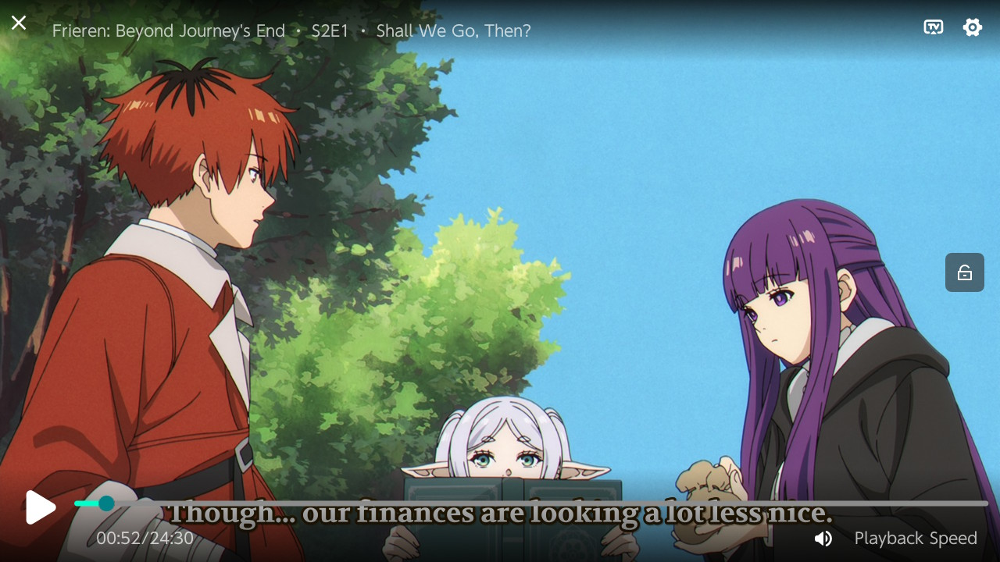
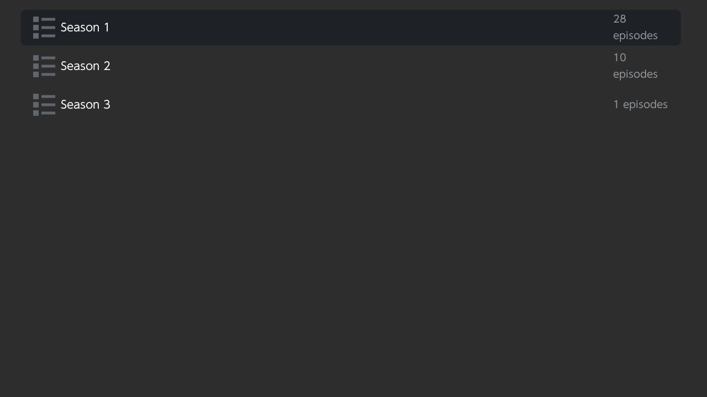

<p align="center">
  
</p>

<h1 align="center">StreamFin</h1>

A **streaming-only Stremio client for homebrewed Nintendo Switch**, built by forking
[Switchfin](https://github.com/dragonflylee/switchfin) and replacing its Jellyfin data layer with
the [Stremio addon protocol](https://github.com/Stremio/stremio-addon-sdk/blob/master/docs/protocol.md).

Browse Cinemeta catalogs, search, open a title page with cast & plot, pick a stream, and play —
all natively on the Switch with MPV. No content is included: **you bring your own Stremio stream
addon URL**, which the app asks for on first launch.

## Screenshots

| Home | Title details |
|---|---|
|  |  |

| Episodes | Playback |
|---|---|
|  |  |

| Season list | On the home menu |
|---|---|
|  |  |

## Features

- **Home screen** — poster carousels: Popular / New / Top Rated / Animation / Documentary,
  movies & series (Cinemeta), with **IMDb rating badges** on every poster
- **Title details** — poster, year, runtime, IMDb rating, genres, description, cast, director
- **Series support** — seasons → episodes with air dates → stream picker
- **Search** (press Y) via the on-screen keyboard
- **Favourites** (press X on any poster) and **Continue Watching** with resume
- **Custom player controls** tuned for streaming (seek on shoulders, lock screen, stream info)
- Streams play as direct HTTPS URLs through MPV — nothing torrent-related runs on the Switch

## Setup

1. Copy `StreamFin.nro` to `/switch/` on your SD card.
2. **Recommended:** while the SD card is still in your PC, create a plain-text file at
   `/switch/streamfin-addon.txt` containing your **stream addon URL** — the base URL of any
   Stremio addon that implements the `stream` resource (with or without `/manifest.json`).
   You can list **several stream addons, one per line** — when you pick something to watch,
   all of them are queried at once and the results merged into one picker (duplicate links
   removed). StreamFin imports the file automatically at launch — no typing on the console.
   Editing the file later updates the settings too. Full format (all lines optional, `#` for
   comments):

   ```
   https://your-stream-addon.example.com/...
   https://another-stream-addon.example.com/...
   rpdb=YOUR_RPDB_KEY
   subtitles=https://your-subtitles-addon.example.com/...
   ```
3. Alternatively, launch without the file and type the URL into the on-screen keyboard when
   prompted (works, but long addon URLs are painful to type; the keyboard sets a single
   addon — use the text file for multiple).
4. Change it any time by pressing **−** on the home screen, or by editing the text file. The
   active URLs are stored at `sdmc:/config/StreamFin/stremio_addon.json`.

Catalog browsing works without an addon; you only need one to actually play streams.

> [!IMPORTANT]
> **A debrid service is required for torrent addons.** StreamFin has no built-in torrent
> engine (unlike desktop Stremio) — it can only play direct HTTP(S) links. Torrent addons
> such as Torrentio must be configured with a debrid service (Real-Debrid, Premiumize,
> AllDebrid, …) so they return direct links. Without one, every result is a raw torrent
> and the stream picker will report there is nothing playable.

### Poster ratings (optional)

Out of the box, every poster shows a small **★ IMDb badge** using data already present in the
Cinemeta catalogs — no key needed. If you prefer posters with the rating **baked into the
artwork**, add a poster provider to `streamfin-addon.txt`:

- `rpdb=YOUR_KEY` — [RatingPosterDB](https://ratingposterdb.com) rated posters (free personal
  key available; paid tiers add more rating sources).
- `poster=https://.../{imdbId}/...` — any provider that serves poster images by IMDb id;
  `{imdbId}` is replaced with the title's id (e.g. `tt1375666`).

When a poster provider is set, the text badge is hidden automatically (the rating is in the
image). Remove the line to switch back.

### Subtitles addon (optional)

Embedded subtitle tracks always work out of the box. To also pull subtitles from a Stremio
**subtitles addon** (SubSource, OpenSubtitles, …), add its base URL to `streamfin-addon.txt`:

```
subtitles=https://your-subtitles-addon.example.com/...
```

When playback starts, StreamFin fetches subtitles for that exact title/episode and adds them to
the player — pick one under **+ → Subtitle** (one per language, alongside any embedded tracks).

## Controls

| Context | Button | Action |
|---|---|---|
| Home | Y | Search |
| Home | X | Add/remove favourite |
| Home | − | Set stream addon URL |
| Detail page | A on ▶ | Watch (movies) / Episodes (series) |
| Player | L / R | Seek back / forward |
| Player | X | Lock screen |
| Player | − | Stream info |
| Player | + | Settings |

## Building

Requires [devkitPro](https://devkitpro.org/) with devkitA64/libnx and Switchfin's custom
[switch-portlibs](https://github.com/dragonflylee/switchfin/releases/tag/switch-portlibs)
(mbedtls, libssh2, dav1d, curl, ffmpeg, libmpv, libjpeg-turbo).

```bash
export PKG_CONFIG_LIBDIR=/opt/devkitpro/portlibs/switch/lib/pkgconfig
export PKG_CONFIG_PATH=/opt/devkitpro/portlibs/switch/lib/pkgconfig
cmake -B build_switch -G Ninja -DPLATFORM_SWITCH=ON -DBUILTIN_NSP=OFF
ninja -C build_switch StreamFin.nro
```

## Credits

- [Switchfin](https://github.com/dragonflylee/switchfin) by dragonflylee — the base app this
  project forks (player, UI framework integration, build system)
- [borealis](https://github.com/natinusala/borealis) — Switch-style UI library
- [Stremio](https://www.stremio.com/) — the addon protocol and the public Cinemeta catalog

## Contact

Bugs and feature requests: please [open an issue](https://github.com/scamNscoot/StreamFin/issues).
Anything else: scamnscoot@outlook.com

## Disclaimer

This app is a generic client for the open Stremio addon protocol. It ships with no media and no
addon. What you stream is determined entirely by the addon URL you configure — you are responsible
for using addons and content you have the right to access.

## License

[Apache-2.0](LICENSE), same as Switchfin.
